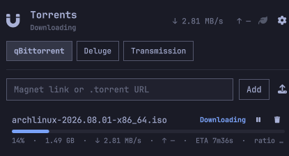

# Torrents

An [Omarchy](https://omarchy.org) bar-widget plugin that monitors and controls
multiple torrent clients — Transmission, qBittorrent, and Deluge.



## Features

- Connect to any number of Transmission, qBittorrent, or Deluge servers.
- See live download/upload speed, progress, ETA, and ratio per torrent.
- Add torrents by magnet link or by uploading a `.torrent` file.
- Pause, resume, and remove torrents.
- Toggle each client's alternative ("turtle") speed limits from the panel.
- Credentials are stored only in the desktop's Secret Service — GNOME
  Keyring by default on Omarchy, KWallet also supported — never in the
  config file. If that's unavailable, saving fails with a clear, blocking
  warning instead of writing the password to disk; there is no plaintext
  fallback.

## Installation

Install with Omarchy's own plugin command:

```sh
omarchy plugin add https://github.com/Xfedis/omarchy-torrents.git --enable
```

This installs it to `~/.config/omarchy/plugins/widget.torrents` (the id from
`manifest.json`). If you'd rather enable it later, drop `--enable` and run
`omarchy plugin enable widget.torrents` whenever you're ready.

Once enabled, add a client connection from the panel's settings.

To update: `omarchy plugin update widget.torrents`.  
To remove: `omarchy plugin remove widget.torrents`.

## Requirements

- Python 3.11+ (for `tomllib`, used to read the plugin's config file).
- `secret-tool` (part of `libsecret`), with a working Secret Service
  provider unlocked — GNOME Keyring (`gnome-keyring-daemon`) is Omarchy's
  default and is unlocked automatically via PAM at login; KWallet also
  works. Without it, adding or editing a client with a password fails
  outright — there is no plaintext fallback, so `config.toml` never holds a
  password.

## Configuration

Client connections are stored in `~/.config/omarchy-torrents/config.toml`
and are managed entirely from the panel's settings screen — there's nothing
to hand-edit.

## License

MIT — see [LICENSE](LICENSE).
